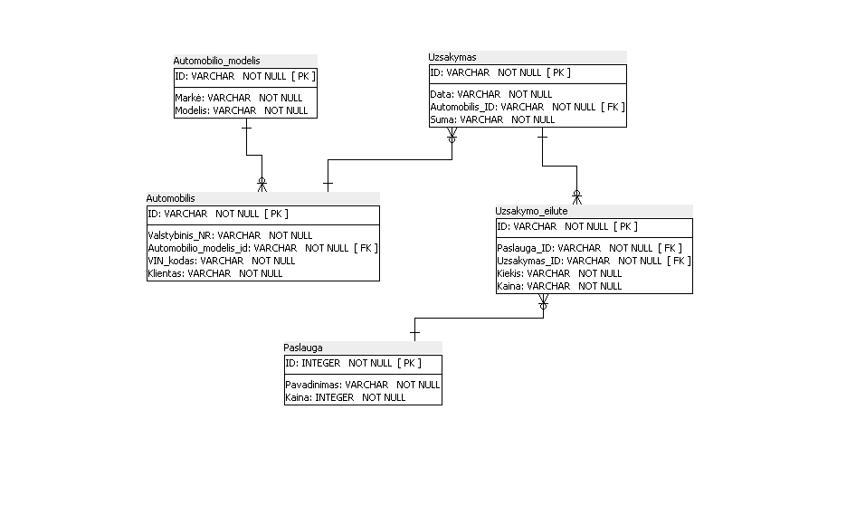

# Užduotis: Autoservisas
Sukurti programą su Django framework'u, kuri leistų įvesti autoservisų informaciją:

* Paslaugas (pavadinimu, pvz. Alyvos keitimas, stabdžių kaladėlių keitimas ir pan.)
* Paslaugų kainas (su paslauga ir jos kaina)
* Automobilių modelius (su metais, markėmis, modeliais ir varikliais)
* Automobiliais (konkrečiais, su automobilio ID, klientu (pradžiai - stringu), valstybiniu numeriu, VIN kodu)
* Taisymo užsakymus (automobiliu, bendra suma ir atskiromis eilutėmis su atliktomis paslaugomis, kiekiais ir kainomis)

## 1
* Sukurti naują Django projektą su appsu Autoservice
* Sukurti visus modelius pagal nurodytą programos DB struktūrą
* Sukurti meniu punktus visiems sukurtiems modeliams
* Susikurti superuser vartotoją, prisijungti ir išbandyti įrašyti visų modelių įrašus

## 2
* Padaryti, kad modelių pavadinimai būtų atvaizduojami teisingai (vienaskaita ir daugiskaita)
* Padaryti, kad užsakymo formoje būtų matomos ir užsakymo eilutės (į jas galima būtų įrašyti informaciją)
* Padaryti, kad užsakymo sąraše būtų matomi automobilio ir datos stulpeliai
* Padaryti, kad automobilių sąraše būtų matomi kliento, automobilio, valstybinio numerio ir VIN numerio stulpeliai
* Padaryti, kad Paslaugų sąraše būtų matomi paslaugos pavadinimų ir kainų stulpeliai
* Į Automobilių sąrašą įdėti filtrą pagal klientą ir automobilio modelį*
* Į Automobilių sąrašą įdėti paiešką pagal valstybinį numerį ir VIN kodą

